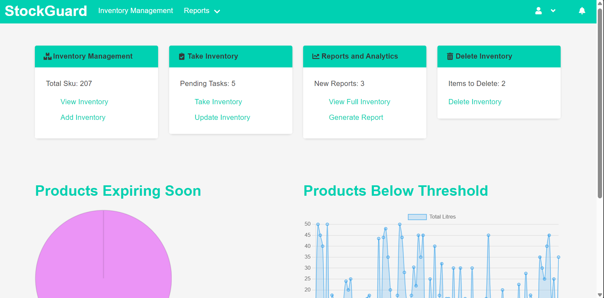

# StockGuard Inventory Management Application

## Overview

StockGuard is a comprehensive inventory management application built using the Flask framework for the backend and HTML, CSS, and JavaScript for the frontend. This application is designed to help businesses efficiently manage their inventory, track stock levels, and generate detailed reports.

## Features

- **User Authentication**: Secure login and registration system with role-based access control.
- **Inventory Management**: Add, update, delete, and view inventory items.
- **Reporting and Analytics**: Generate reports for inventory levels, items below threshold, and products expiring soon.
- **Automated Email Notifications**: Receive alerts for low inventory levels and products nearing expiration.
- **Data Export**: Download reports in Excel format.

## Technologies Used

- **Backend**: Flask, SQLAlchemy, Flask-Mail, APScheduler
- **Frontend**: HTML, CSS, JavaScript
- **Database**: MYSQL (or any SQL database supported by SQLAlchemy)
- **Other Libraries**: Pandas, Openpyxl, jwt

## Installation

1. **Clone the repository**:
    ```bash
    git clone https://github.com/Israelshecktar/IMS.git
    cd stockguard
    ```

2. **Create a virtual environment**:
    ```bash
    python3 -m venv venv
    source venv/bin/activate  # On Windows use `venv\Scripts\activate`
    ```

3. **Install the dependencies**:
    ```bash
    pip install -r requirements.txt
    ```

4. **Set up the database**:
    ```bash
    flask db init
    flask db migrate
    flask db upgrade
    ```

5. **Run the application**:
    ```bash
    flask run
    ```

## Usage

1. **Login/Register**: Access the application by logging in or registering a new account.
2. **Dashboard**: View the main dashboard with quick access to inventory management and reporting features.
3. **Manage Inventory**: Add new inventory items, update existing ones, or delete items no longer needed.
4. **Generate Reports**: Create detailed reports on inventory levels, low stock items, and products nearing expiration.
5. **Automated Notifications**: Receive email alerts for low inventory levels and expiring products.

## Screenshots


*StockGuard Dashboard page.*

## Contributing

Contributions are welcome! Please fork the repository and submit a pull request with your changes.

## License

This project is licensed under the MIT License. See the [LICENSE](LICENSE) file for details.

## Acknowledgements

- **ALX Africa**: A special thanks to ALX Africa for their incredible support and guidance throughout the software engineering program. ALX Africa is dedicated to addressing the global shortage of tech talent by providing world-class training and resources to aspiring tech professionals across the continent. Their programs, in partnership with the Mastercard Foundation, offer accessible and high-quality education in various tech fields, empowering the next generation of African leaders.
